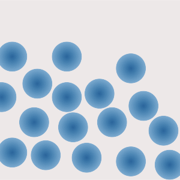
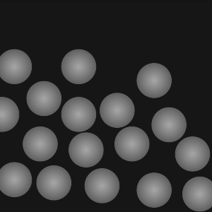

# 3D-swing

## 概要

入力されたRGB画像と深度画像の組を3Dに変換し, そのスイング動画を生成するサイト

### URL

<https://suzukilab-chuo-university.github.io/3D-swing>

### 入力画像の例

左がRGB画像, 右が深度画像の例

 

### 出力される3Dモデルの例


## 使用方法

- Select Texture を押し, RGB画像を入力
- Select Depth を押し, 深度画像を入力
- Generate を押し, 中央に3Dモデルが表示されることを確認
- Depthで奥行の拡大率を, Angleでスイングの角度, Speedでスイングの速度をそれぞれ変更できる

## 制約

- 画像形式は .jpg .png のみに対応
- Windows, Mac 環境以外での動作は未確認

## フォルダ構造

```.
├── docs:    deployするWebサイトのデータ
├── example: READMEに使用する画像
├── project: Webサイトを作成するUnityのプロジェクト
├── .gitignore
└── README.md
```

## 今後追加予定の機能

- 一時停止ボタンの追加
- 他の拡張子への対応
- スマートフォンを含む他のOSへの対応への対応
